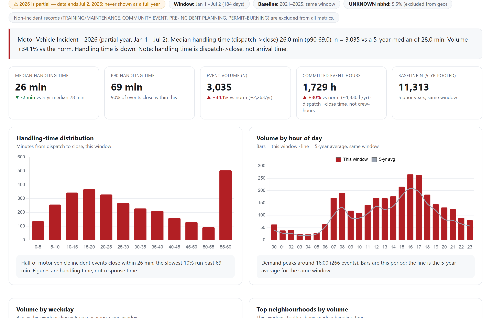
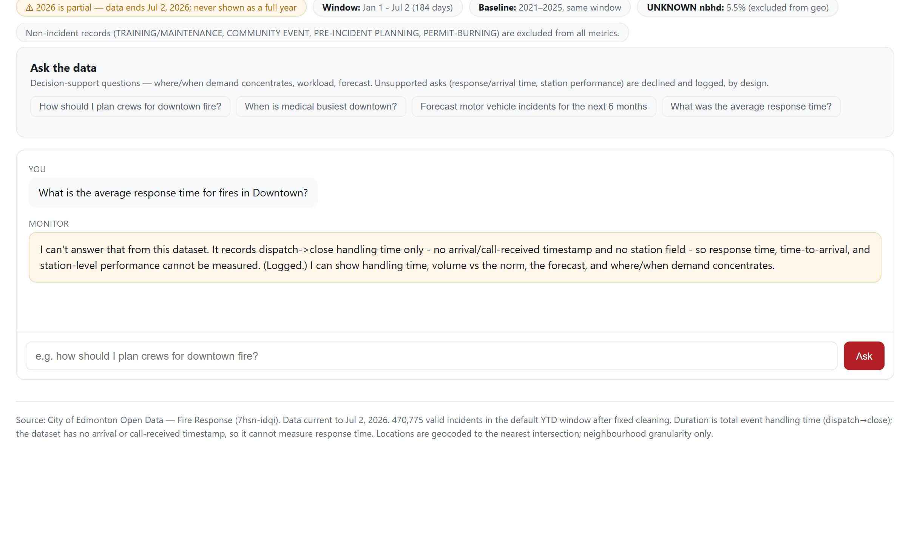

# EFRS Incident Duration & Workload Monitor

An honesty-first public-data dashboard: it turns ~946K raw City of Edmonton fire
dispatch records (2011 → present) into incident **volume** and **handling-time** monitoring
read against 5-year historical baselines, for fire-rescue operations leadership.

- **Run it in one command:** `pip install -r requirements.txt && python app/server.py` (details below; optional self-hosting in [DEPLOY.md](DEPLOY.md))
- **Final report:** [`report/FINAL_REPORT.md`](report/FINAL_REPORT.md)
- **Evaluation:** known-answer test suite, 6/12 baseline → 12/12 after fixes — see [`evaluation/`](evaluation/)

## What it looks like





## Why it looks like this

Every design decision serves one bar: *a number the operations lead can say out loud in a
review and defend*. The dataset has no arrival or call-received timestamp, so the app
**refuses** to show "response time" — duration is always labelled **event handling time
(dispatch→close)**. Refusals are a feature: the chatbot declines unsupported asks (response
times, station rankings) and logs them; overrides are logged; every metric carries its N and
a like-for-like 5-year baseline for the same calendar window.

## Architecture

| Layer | Tech |
|---|---|
| Backend | Flask + pandas/numpy (`app/server.py`), gunicorn in prod |
| Frontend | Single-file SPA (`app/static/index.html`), Chart.js + Leaflet choropleth |
| Data | City of Edmonton Open Data SODA API `7hsn-idqi` — frozen snapshot builds the cache, `/api/refresh` pulls daily increments live |
| Governance | `claim-guard` refusal gates in code, before any model call; the optional Gemini layer only rephrases already-computed answers |
| Agent workflow | [`.agents/skills/`](.agents/skills/) — three project skills (`incident-data-guard`, `claim-guard`, `presentation-render`) + the living spec in [`AGENTS.md`](AGENTS.md) |
| Deploy | GitHub → Render (`render.yaml`, `Procfile`), free tier, runs cache-only |

### API

`/api/meta` · `/api/metrics` · `/api/forecast` · `/api/geo` · `/api/refresh` · `/api/ask` —
every payload carries N and a 5-year baseline for the same window. See
[`app/README.md`](app/README.md) for details.

## Run locally

```bash
git clone <this repo>
cd efrs-workload-monitor/app
pip install -r requirements.txt
python server.py            # http://127.0.0.1:5000
```

First start parses the bundled cleaned cache in ~1s. To rebuild from the raw source:
download the [Fire Response dataset](https://data.edmonton.ca/Community-Services/Fire-Response-Current-and-Historical/7hsn-idqi)
(~315 MB CSV) into `Dataset/`, delete `app/.cache_v5.pkl`, and restart — or point `EFRS_CSV`
at any snapshot path. Port override: `PORT`.

Optional Gemini phrasing layer for the chatbot: set `GEMINI_PROJECT` (or
`GOOGLE_CLOUD_PROJECT`) with Application Default Credentials; without it the app runs
fully offline and deterministic.

## Repository layout

```
AGENTS.md            living specification (read first)
app/                 Flask backend + SPA frontend + cleaned-data cache
Knowledge/           data dictionary, cautions, profile, source pointers
evaluation/          deployment assessment + machine/human critic findings
report/              final project report
.agents/skills/      the three project agent skills
```

## Data licence

Contains information licensed under the
[Open Government Licence – Edmonton](https://data.edmonton.ca/stories/s/City-of-Edmonton-Open-Data-Terms-of-Use/msh8-if28/).
Neighbourhood boundaries: City of Edmonton Open Data `xu6q-xcmj`.
